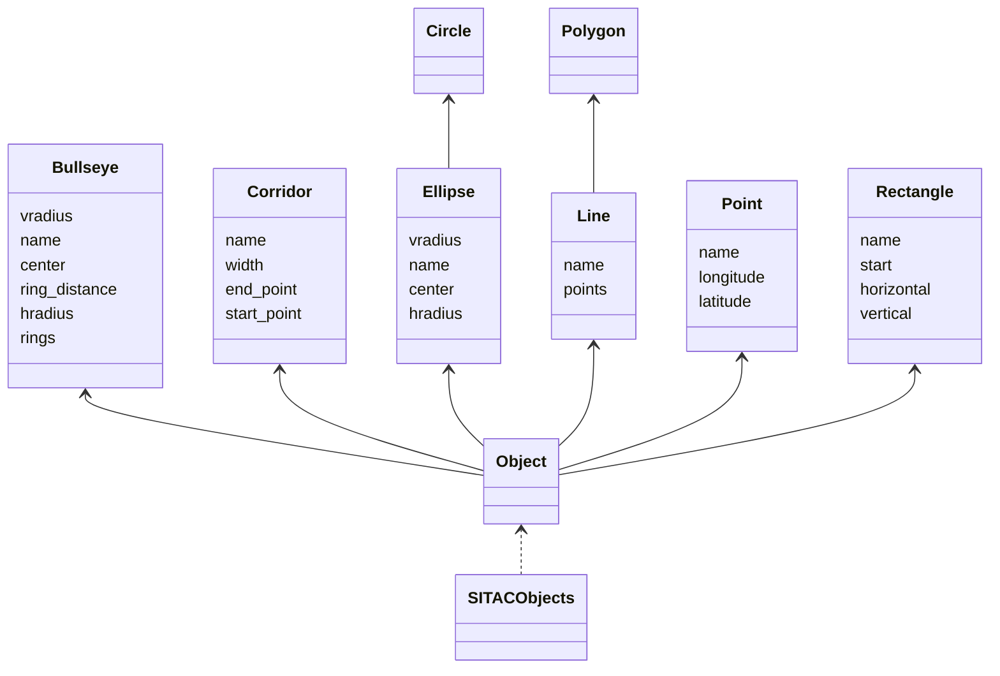

# Projet Compilation S4 (CoMe_NG)
CoMe_Ng, le cousin éloigné de Melissa

## Objectifs du projet
La création d'un compilateur, composé impérativement :
- d'un _lexer_
- d'un _parser_
- d'un générateur d'_AST_
- d'un _pretty-printer_ permis par le _pattern_ Visiteur

## Portée du sujet
Le sujet, au-delà du projet de compilation en lui-même, est réalisé au profit des équipages CN-235 de l'Armée de l'Air et de l'Espace, et peut donc sembler plutôt spécifique. Nous allons donc le présenter ici.

### Les attendus
Les équipages de transport, lors de vols tactique, ont besoin en amont de préparer leur "Situation Tactique" (SiTac). Cette dernière, réalisée sur des outils spécialisés (tels `Melissa_NG`), est alors généralement imprimée puis emportée dans le cockpit en version papier.

Néanmoins, dans le cadre de vols d'entraînement, pour lesquels les données sont Non Protégées car imaginées pour besoin d'exercice, il devient intéressant de pouvoir disposer d'une version numérique de cette SiTac, pouvant être affichée sur les iPads des équipages.

Les logiciels ne possédant pas nativement de capacités d'exportation au format `kml`, il était nécessaire de fournir un tel outil, permettant de générer un fichier `kml` à partir d'une SiTac exportée dans le format permis par le logiciel.

Une première version très succincte de ce projet, réalisée en `VBA` sur Microsoft Excel, a été réalisée par mes soins au sein de l'unité, et il semblait indispensable d'en proposer une version plus adaptée et facile d'utilisation.

### Entrée
Un fichier exporté par un logiciel de cartographie spécialisée, au format XML, de forme dépendant du logiciel utilisé (`NTK`, `Melissa_NG`...).

### Sortie
Un fichier `kml` contenant les objets de la SITAC, qu'il est possible d'afficher sur un outil de cartographie grand public (Google Earth, TacView...)


## Le projet
Le projet, intitulé "CoMe_NG", pour "Convertisseur Melissa de Nouvelle Génération", écrit en `Ruby`, permet donc de réaliser cette conversion de manière simple et rapide.

## Utilisation
On donne un fichier `test.xml`, dans le répertoire `input`, à des fins de test. D'autres fichiers, générés par ntk, pourront être ajoutés au fur et à mesure des essais menés en escadron.

- Pour convertir le fichier en `kml`, depuis le répertoire racine (`CoMe_NG`) :
```bash
ruby come_ng.rb input/test.xml
```

- Pour afficher les options disponibles :
```bash
ruby come_ng.rb -h
```

- Pour afficher l'AST :
```bash
ruby come_ng.rb input/test.xml -a
```

L'export est alors réalisé dans le répertoire `output`, et il est possible de l'afficher sur Google Earth, par exemple.

## Structure du projet
Le projet est composé des fichiers `Ruby` suivants :
- `come_ng.rb` : le fichier principal, qui permet de lancer la conversion
- `sitac_lexer.rb` : le lexer, qui permet de "découper" le fichier XML en tokens
- `sitac_parser.rb` : le parser, qui permet de "parser" les tokens et de générer l'AST
- `ast.rb` permettant la génération de l'AST
- `sitac_objects.rb` : le fichier contenant les classes génériques des objets de la SiTac
- `sem_ntk.rb` : le fichier contenant la sémantique spécifique à la SiTac NTK
- `kml_maker.rb` : conversion des objets créés en fichier KML
- `log_utils.rb` implémentant un logger, permettant d'afficher des informations claires dans la console
- `token.rb` implémentant la classe Token, permettant de représenter les tokens

## Objets pris en charge



